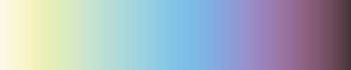

# Blind

Package `blind` implement color gradients
that are friendly for color blind people.

The color schemes are taken from [Paul Tol](https://personal.sron.nl/~pault/) page.

Here is a color gradient build by the [gradient example](blind_gradient_test.go)
based on [rainbow color scheme (purple to red)](https://personal.sron.nl/~pault/#fig:scheme_rainbow_smooth).

## Implemented color schemes

Here are another gradients:

[Iridescent color scheme](https://personal.sron.nl/~pault/#fig:scheme_iridescent)

## Authorship and license

Color schemes copyright © 2022 Paul Tol <https://personal.sron.nl/~pault/>
Code copyright © 2023 J. Salvador Arias <jsalarias@gmail.com>.
All rights reserved.
Distributed under BSD3 licenses that can be found in the LICENSE file.
